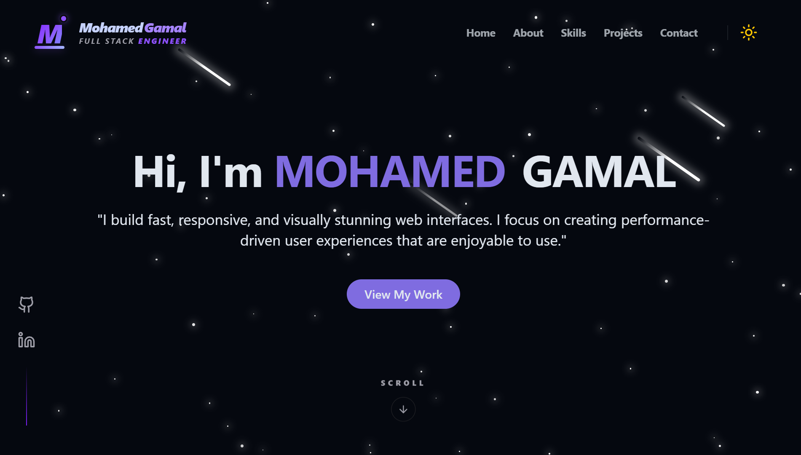
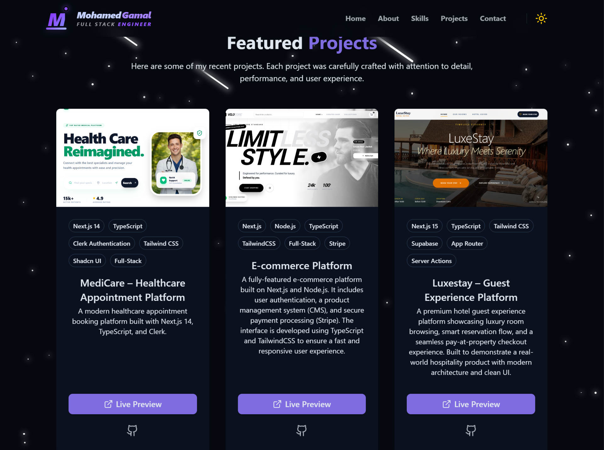
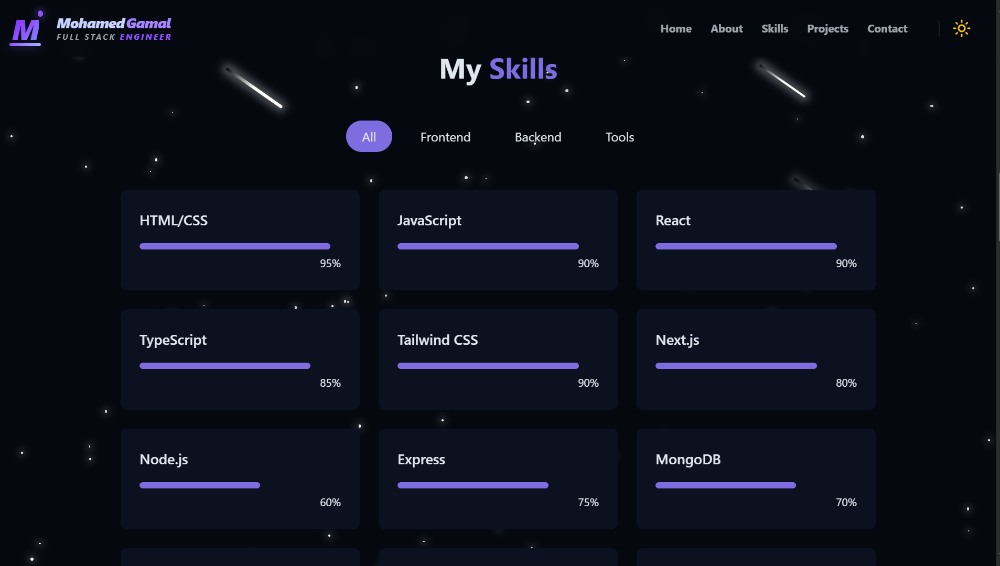
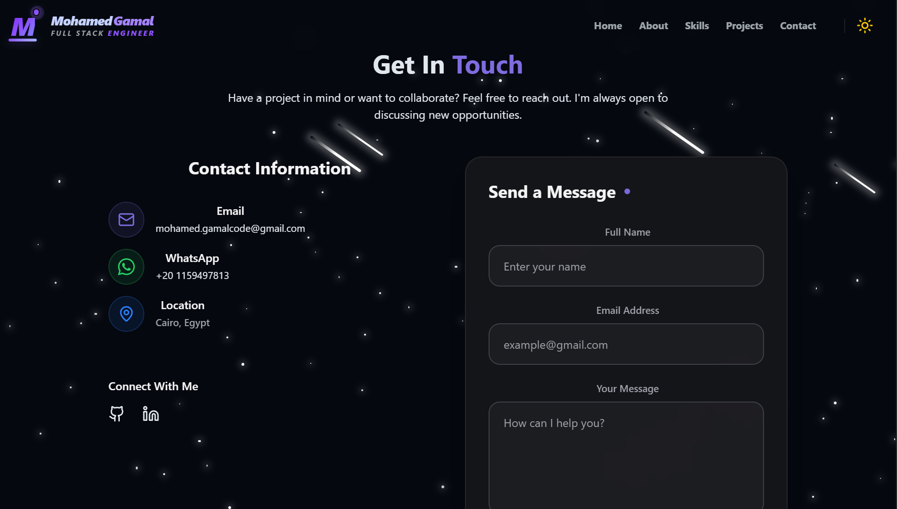

<!-- @format -->

<div align="center">

# 🗂️ Mohamed Gamal — Legacy Portfolio

### An earlier version of my personal portfolio

<p align="center">
  <a href="https://mohamed-gamal-space.vercel.app/">
    
  </a>
  &nbsp;&nbsp;
  <a href="https://github.com/Mohamed-Gamal-code/my-portfolio">
    
  </a>
</p>

<p align="center">
  
  
  
 
</p>

</div>

---

## 📌 About This Project

This repository contains an **earlier version** of my personal portfolio.

While it is no longer actively maintained, it represents an important step in my journey as a developer and highlights my progress over time.

---

## ⚠️ Note

> This project is **archived** and not actively updated.  
> For the latest version, please check my current portfolio.

---

## 🚀 Live Demo

👉 https://mohamed-gamal-portfolio-alpha.vercel.app

---

## 🖼️ Screenshots

<div align="center">

### 🏠 Home

<p align="center">
  
</p>

### 💼 Projects

<p align="center">
  
</p>
### 🛠️ Skills

<p align="center">
  
</p>


### 📬 Contact
<p align="center">
  
</p>

---

</div>
## ✨ Features

- Responsive design
- Basic UI/UX implementation
- Early use of modern frontend tools
- Foundational project structure

---

## 🛠️ Tech Stack

<div align="center">
  
  
  
  
  
</div>

---

## 🚀 Getting Started

```bash
# Clone the repository
git clone https://github.com/Mohamed-Gamal-code/my-portfolio

# Navigate to project
cd old-portfolio-repo

# Install dependencies
npm install

# Run development server
npm run dev
```
--- 
### 💫 Final Note
<div align="center">

This project represents the beginning of my journey — and every line of code here helped me grow.

<br/>

Made with ❤️ by [Mohamed Gamal](https://github.com/Mohamed-Gamal-code)

</div>
